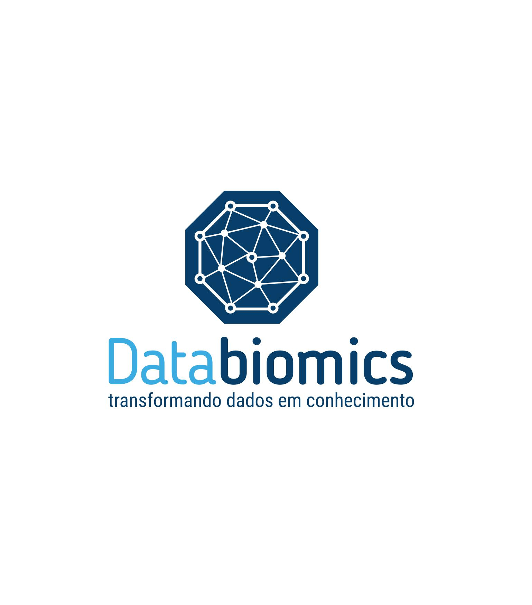
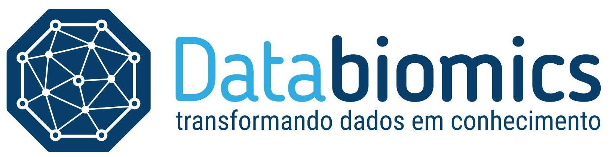

### Databiomics:
 

 

**Databiomics®, including name and logo is a Trademark/Copyright registred (2021) at INPI (National Institute of Patents and Interlectual Property at Brazil) by Leandro de Mattos Pereira - Networks globe/spheres containing accessed (functional) and non-accessed (non-functional) connections/networks which symbolizes the transformation of data into knowledge using data integration with Computational biology, Bioinformatics methods and Data Science.**
