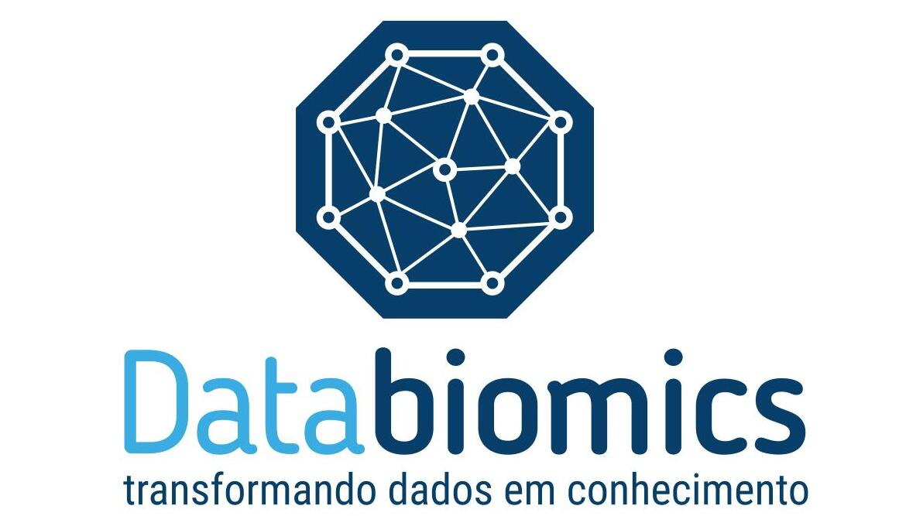

### Databiomics:
 

 

**®Databiomics is a Trademark/Copyright registred at INPI (National Institute of Patents and Interlectual Property - Brazil) by Leandro de Mattos Pereira - Networks globe/spheres containing accessed (functional) and non-accessed (non-accessed) connections which symbolizes the transformation of data into functional knowledge using data integration with Computational biology, Bioinformatics methods and Data Science.**
